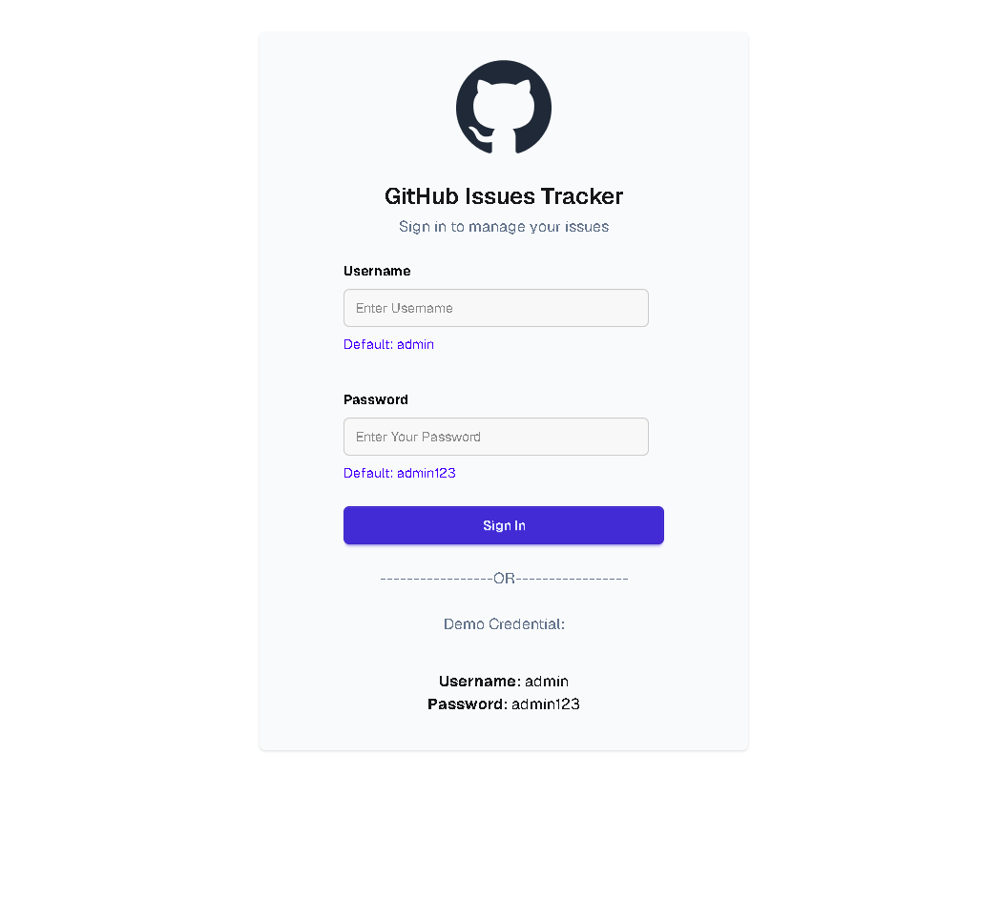
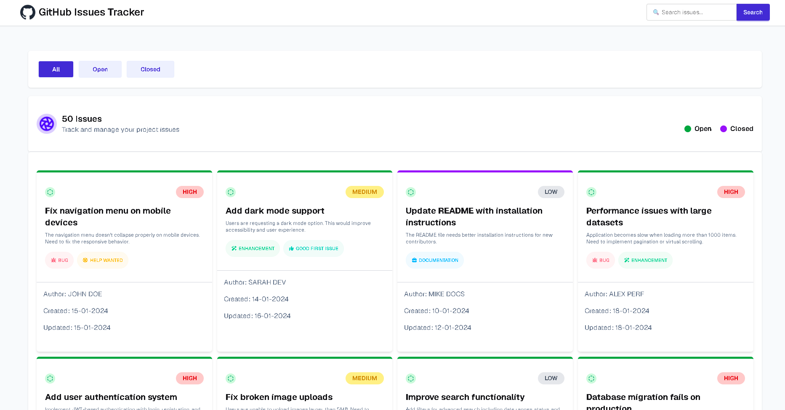
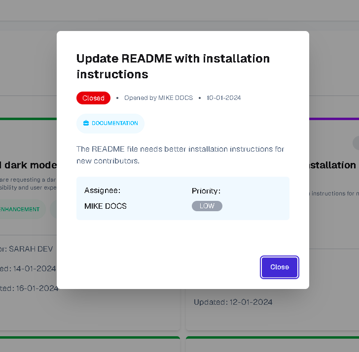

# GitHub Issues Tracker

A responsive issue-tracking web application built with <b>HTML, CSS, and Vanilla JavaScript</b>. The app authenticates a user via a login page and then displays issues fetched from a live API, with tab-based filtering (All / Open / Closed), card-based layouts, a detail modal, and search functionality.

---

## 📖 Table of Contents

- [Overview](#-overview)
- [Live Demo](#-live-demo)
- [Screenshots](#-screenshots)
- [Features](#-features)
- [Tech Stack](#-tech-stack)
- [API Reference](#-api-reference)
- [Project Structure](#-project-structure)
- [Getting Started](#-getting-started)
- [Demo Credentials](#-demo-credentials)
- [Folder & File Notes](#-folder--file-notes)
- [Learning & Reflection](#-learning--reflection)
- [Author](#-author)

---

## 🧾 Overview

This project is part of my course Assignment and simulates a simplified GitHub Issues dashboard. After signing in with demo admin credentials, the user lands on a main dashboard that fetches issue data from a remote API and displays it in a clean, card-based UI. Users can filter issues by status (All, Open, Closed), search for specific issues, and click any card to view its full details in a modal.

---

## 🌐 Live Demo

> 🔗 **Live Site:** [https://raselbabu273.github.io/github-issues-tracker/] <br>
> 🔗 **Repository:** [https://github.com/raselbabu273/github-issues-tracker]

---

## 🖼️ Screenshots

| Login Page | Main Dashboard | Issue Modal |
| :---: | :---: | :---: |
|       |       |       |

---

## ✨ Features

### 🔐 Authentication
- Custom login page with logo, title, and subtitle, matching the provided Figma design
- Username and password input fields with a **Sign In** button
- Demo credentials displayed directly on the login page for quick access
- Basic client-side validation against the demo admin credentials

### 📊 Main Dashboard
- **Navbar** with the site logo/name on the left and a search input + button on the right
- **Tab navigation** — `All`, `Open`, and `Closed` — with an active-state highlight on the selected tab
- A summary section below the tabs showing an icon, the total issue count, and status indicators (open/closed markers)
- **4-column responsive card grid** displaying:
  - Title
  - Description
  - Status
  - Author
  - Priority
  - Label(s)
  - Created date
- Color-coded **top border on each card**:
  - 🟢 Green border → Open issues
  - 🟣 Purple border → Closed issues

### 🔍 Search
- Live search bar in the navbar that queries the search API endpoint and re-renders the issue grid with matching results

### 🧩 Issue Detail Modal
- Clicking any issue card opens a modal with the full issue details (title, description, author, priority, labels, and timestamps)

### ⏳ Loading & UX States
- Loading spinner displayed while data is being fetched from the API
- Active/inactive button styles for tab switching
- Fully responsive layout that adapts gracefully to mobile screen sizes

---

## 🛠️ Tech Stack

| Technology | Purpose |
| --- | --- |
| **HTML5** | Page structure and semantic markup |
| **CSS3 / Tailwind / DaisyUI** | Styling, layout, and responsiveness |
| **JavaScript (Vanilla)** | DOM manipulation, fetch calls, state handling, and event logic |
| **REST API** | External data source for issues |

---

## 🔌 API Reference

Base URL: `https://phi-lab-server.vercel.app/api/v1/lab`

| Purpose | Method | Endpoint | Example |
| --- | --- | --- | --- |
| Get all issues | `GET` | `/issues` | `https://phi-lab-server.vercel.app/api/v1/lab/issues` |
| Get a single issue | `GET` | `/issue/{id}` | `https://phi-lab-server.vercel.app/api/v1/lab/issue/33` |
| Search issues | `GET` | `/issues/search?q={searchText}` | `https://phi-lab-server.vercel.app/api/v1/lab/issues/search?q=notifications` |

### Sample Issue Object

```json
{
  "id": 33,
  "title": "Add bulk operations support",
  "description": "Allow users to perform bulk actions like delete, update status on multiple items at once.",
  "status": "open",
  "labels": ["enhancement"],
  "priority": "low",
  "author": "bulk_barry",
  "assignee": "",
  "createdAt": "2024-02-02T10:00:00Z",
  "updatedAt": "2024-02-02T10:00:00Z"
}
```

---

## 📁 Project Structure

```
assignment-05-github-issues-tracker/
├── index.html          # Login page
├── dashboard.html      # Main issues dashboard
├── css/
│   └── style.css       # Custom styles (or Tailwind config)
├── js/
│   ├── auth.js          # Login & credential validation logic
│   ├── api.js           # Fetch calls to the issues API
│   ├── ui.js             # Rendering cards, modal, tabs, search
│   └── main.js           # App initialization & event bindings
├── assets/
│   └── images/          # Logo and icons
└── README.md
```

> ℹ️ Adjust the structure above to match your actual implementation if it differs.

---

## 🚀 Getting Started

### Prerequisites
- A modern web browser (Chrome, Firefox, Edge, etc.)
- (Optional) A local development server such as the **Live Server** VS Code extension, since `fetch` requests work best when served over `http://` rather than `file://`

### Installation & Running Locally

1. **Clone the repository**
   ```bash
   git clone https://github.com/raselbabu273/github-issues-tracker.git
   ```

2. **Navigate into the project folder**
   ```bash
   cd github-issues-tracker
   ```

3. **Open the project**
   - Open `index.html` directly in your browser, **or**
   - Right-click `index.html` → "Open with Live Server" (recommended)

4. **Log in** using the demo credentials below to access the dashboard

---

## 🔑 Demo Credentials

```
Username: admin
Password: admin123
```

---

## 👤 Author

**Your Name**
- GitHub: [@raselbabu273](https://github.com/raselbabu273)

---

## 📄 License

This project was created for educational purposes as part of a course assignment.
